# Fast style transfer in tf v2

A tensorflow v2 implementation of [fast style transfer method][fast].

**udnie style**

<p align = 'center'>


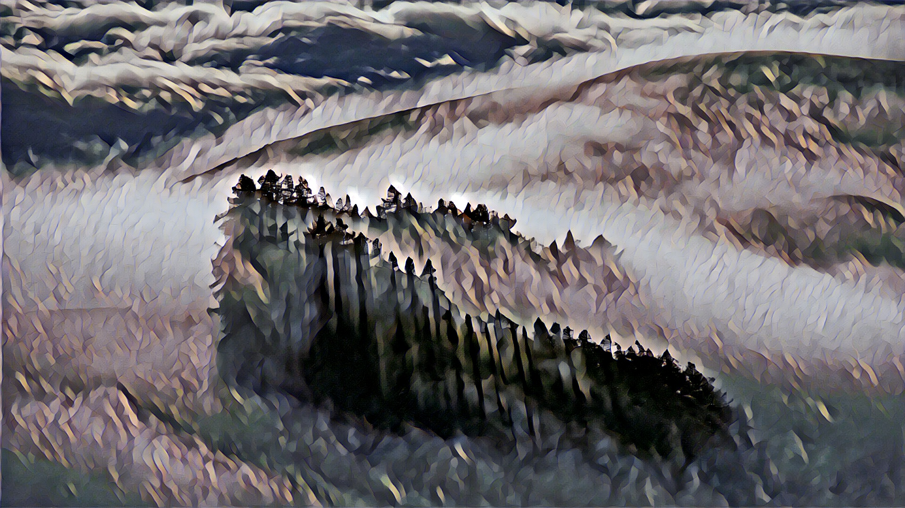
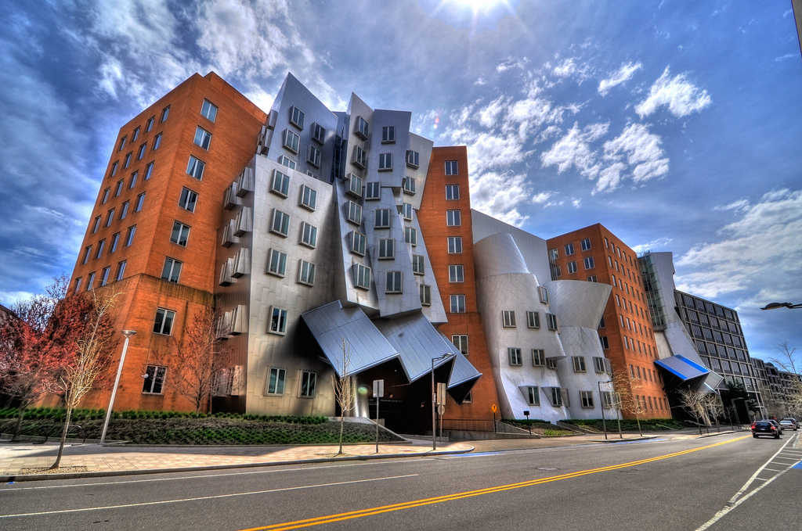
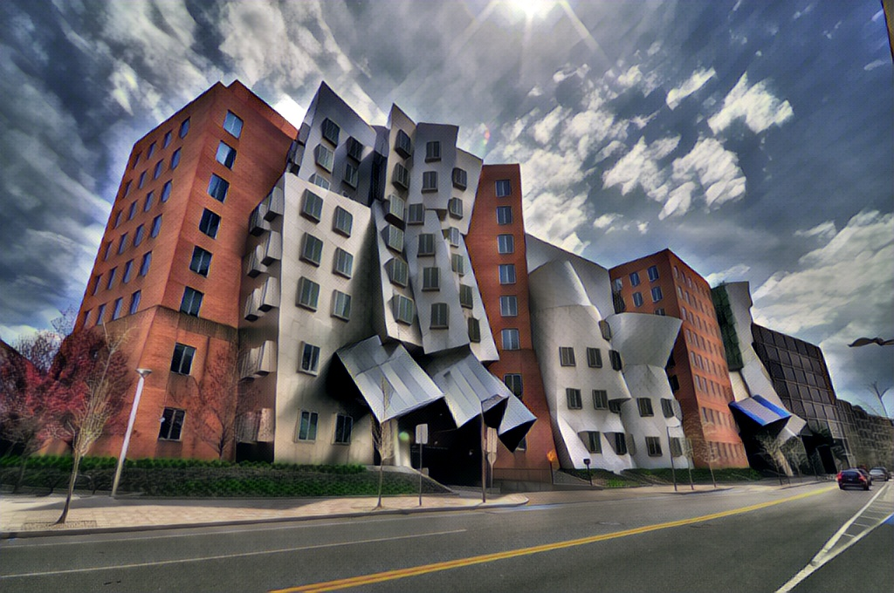
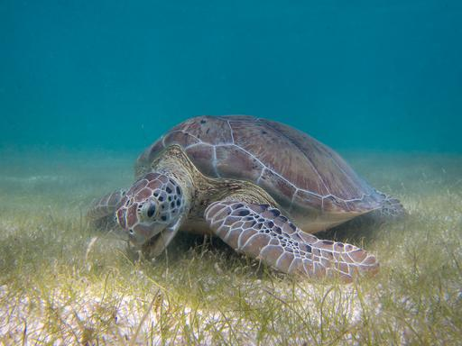

</p>

**wave style**

<p align = 'center'>


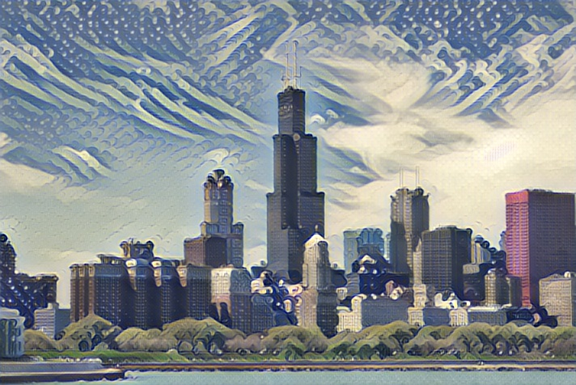

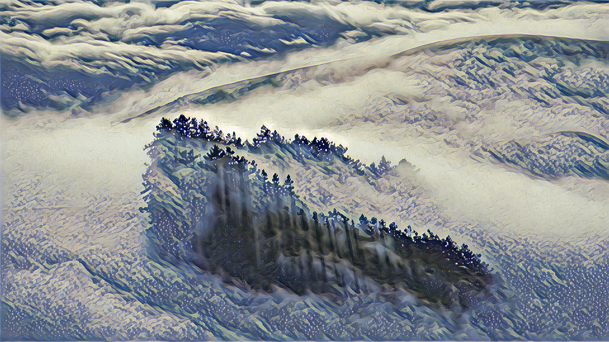

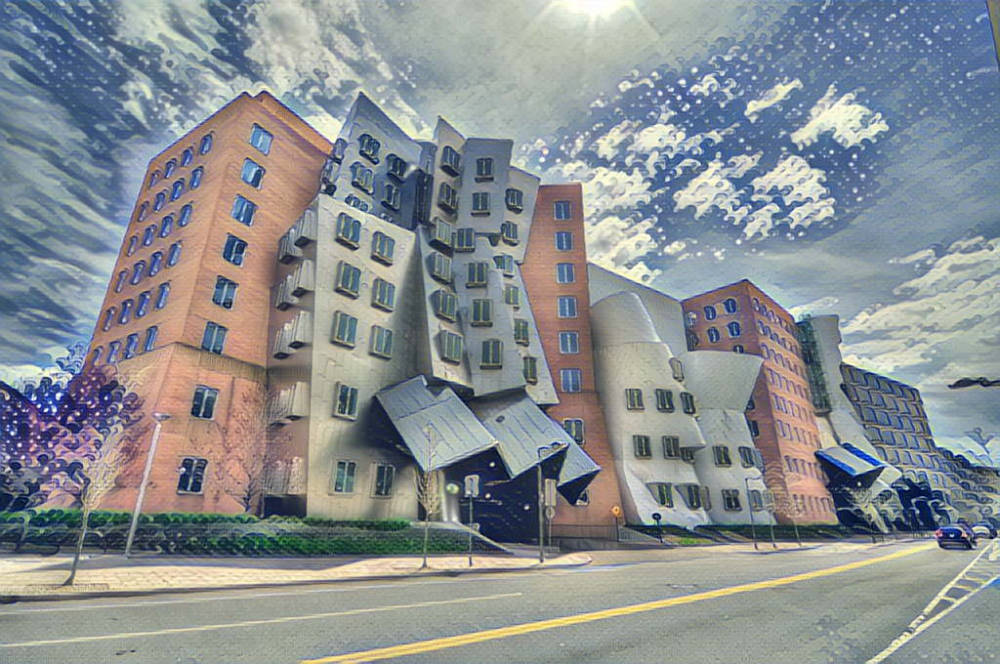

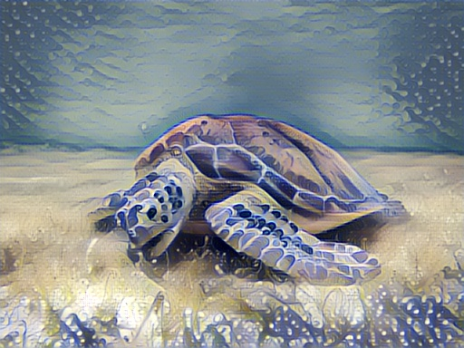
</p>


**styled video (click to play video)**

<p align = 'center'>
<a href="https://dreamanddead-github-io.oss-cn-hongkong.aliyuncs.com/style-transfer/fox.mp4">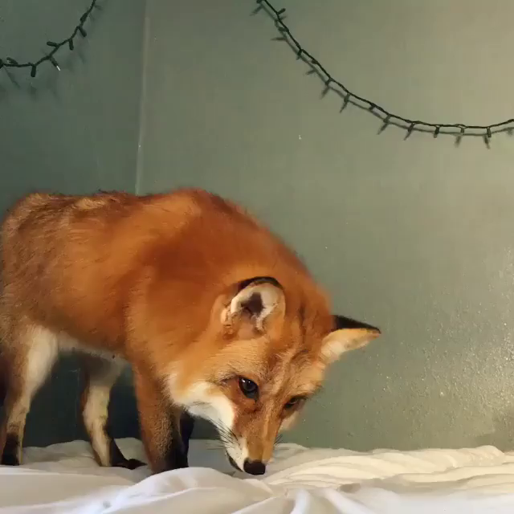</a>
<a href="https://dreamanddead-github-io.oss-cn-hongkong.aliyuncs.com/style-transfer/udnie_fox.avi">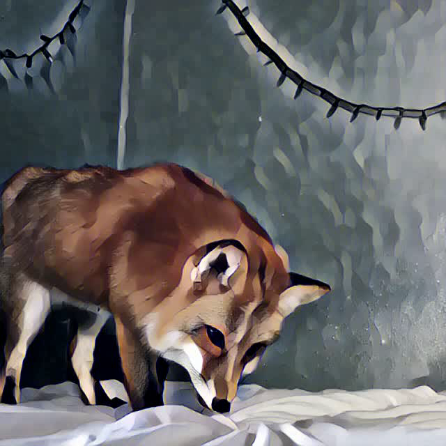</a>
<a href="https://dreamanddead-github-io.oss-cn-hongkong.aliyuncs.com/style-transfer/wave_fox.avi">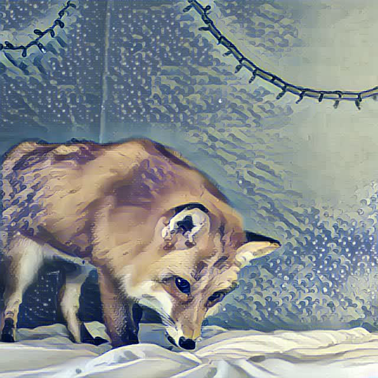</a>
</p>


## stylish

stylish image

```bash
$ python evaluate.py --type image --weight model/udnie/weights.h5 --content input/udnie/chicago.jpg --output output/udnie/chicago.jpg
```

stylish video

```bash
$ python evaluate.py --type video --weight model/udnie/weights.h5 --content input/video/fox.mp4 --output output/udnie/fox.avi
```

## model

there're some pretrained model to [download][model].

each model dir contains
- model weights
- generated test images
- loss logs for tensorboard

[model]: https://aistudio.baidu.com/aistudio/datasetdetail/33631


## develop

### prequisite

download [coco2014 dataset][coco] in `./data` dir.

```
data/
└── train2014/
    ├── *.jpg
    ├── .....
    ├── .....
    ├── .....
    └── *.jpg
```

[coco]: http://msvocds.blob.core.windows.net/coco2014/train2014.zip


### train

e.g. train model using udnie style, chicago as test image, output model in `model/udnie` dir.

```bash
$ python train.py --style-image input/style/udnie.jpg --test-image input/content/chicago.jpg --output model/udnie
```

### tensorboard

launch tensorboard to check the training losses.

```bash
$ tensorboard --logdir ./model --bind_all
```

<p align='center'>
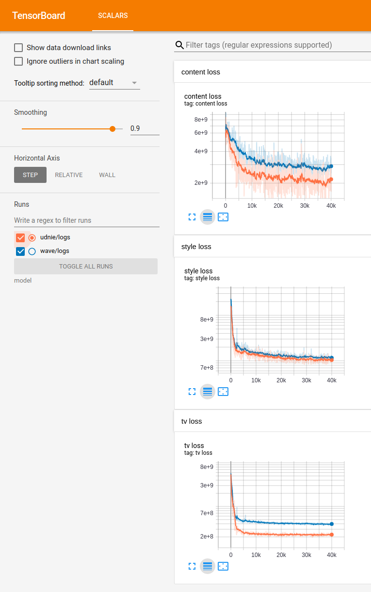
</p>


## refs

this project heavily borrow the code from project [lengstrom/fast-style-transfer][fast] but using tf v2 and keras model.

this implementation is based on
- [Supplementary material][supplementary] of Justin's paper [Perceptual Losses for Real-Time Style Transfer and Super-Resolution][origin]
- Gatys' wonderful idea [A Neural Algorithm of Artistic Style][gaty]
- Ulyanov's [Instance Normalization: The Missing Ingredient for Fast Stylization][instance]

also, [Tensorflow official site][tf tutorial] and [Justin's ppt in cs20si][ppt] help a lot.


[tf tutorial]: https://tensorflow.google.cn/tutorials/generative/style_transfer
[fast]: https://github.com/lengstrom/fast-style-transfer
[origin]: https://cs.stanford.edu/people/jcjohns/eccv16/
[supplementary]: https://web.eecs.umich.edu/~justincj/
[gaty]: https://arxiv.org/abs/1508.06576
[ppt]: ./paper/06_00_slides.pdf
[instance]: https://arxiv.org/abs/1607.08022
